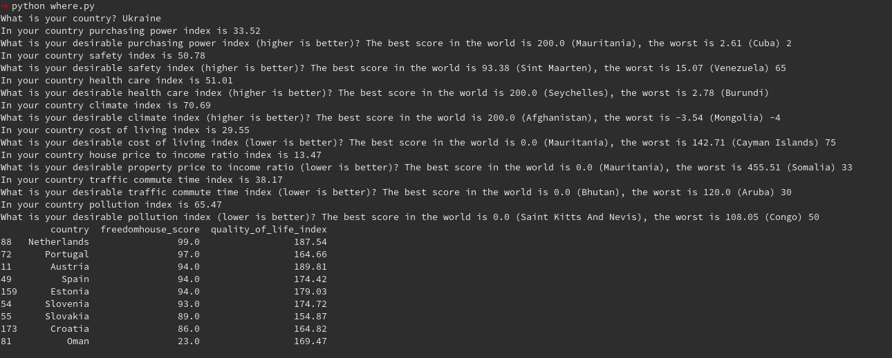

[](https://GitHub.com/serhii73/place2live/graphs/commit-activity)
[](https://www.python.org/)
[](https://github.com/python/black)
[](https://GitHub.com/serhii73/place2live/graphs/contributors/)
[](https://GitHub.com/serhii73/place2live/stargazers/)

[](https://GitHub.com/serhii73/place2live/issues/)
[](https://codeclimate.com/github/serhii73/place2live/maintainability)
[](https://bettercodehub.com/)
[](https://lgtm.com/projects/g/serhii73/place2live/alerts/)
[](https://lgtm.com/projects/g/serhii73/place2live/context:python)
[](https://app.codacy.com/app/serhii73/place2live?utm_source=github.com&utm_medium=referral&utm_content=serhii73/place2live&utm_campaign=Badge_Grade_Dashboard)
[](https://pyup.io/repos/github/serhii73/place2live/)
[](https://pyup.io/repos/github/serhii73/place2live/)

This project gives you a list of countries with a higher quality of life.
The analysis is performed based on [numbeo's](https://www.numbeo.com) data.
Additionally, [freedomhouse's](https://freedomhouse.org) score for each country is included.

1. [About Quality of Life Indices](https://www.numbeo.com/quality-of-life/indices_explained.jsp) -

    The Quality of Life Index (higher is better) is an estimation of overall quality of life by using an empirical formula which takes into account:
    1. [purchasing power index](https://www.numbeo.com/cost-of-living/cpi_explained.jsp) (higher is better)
    2. [safety index](https://www.numbeo.com/crime/indices_explained.jsp) (higher is better)
    3. [health care index](https://www.numbeo.com/health-care/indices_explained.jsp) (higher is better)
    4. [climate index](https://www.numbeo.com/climate/indices_explained.jsp) (higher is better)
    5. [cost of living index](https://www.numbeo.com/cost-of-living/cpi_explained.jsp) (lower is better)
    6. [house price to income ratio](https://www.numbeo.com/property-investment/indicators_explained.jsp) (lower is better)
    7. [traffic commute time index](https://www.numbeo.com/traffic/indices_explained.jsp) (lower is better)
    8. [pollution index](https://www.numbeo.com/pollution/indices_explained.jsp) (lower is better)

2. Also integrated into the score is the [Freedomhouse](https://freedomhouse.org) aggregate Score (0=Least Free, 100=Most Free)

Want to see where the quality of life is higher?

1. Install [Python 3.7](https://www.python.org/). *Earlier versions will not work.*
2. Create and activate the virtual environment: `python3 -m venv /path/to/new/virtual/environment`. The path can be any directory not currently in use. If you type a directory name that doesn't exist, one will be created. You can read more about it [here](https://docs.python.org/3.7/library/venv.html).
3. Install requirements `pip install -r requirements.txt`<br>These can be found in requirements.txt if you need to install them one-by-one. They include:
    * pandas==0.25.1
    * pre-commit==1.18.3
4. `python where.py` will run the application.

Note: if you run into a problem getting this to work, try the following at the command line (in the place2live directory):
1. `python3 -m venv env`
2. `source env/bin/activate`
3. `pip install -r requirements.txt`
4. `python where.py`

Hopefully that will resolve the issue.



Running with Docker

Instead of installing Python yourself, this script can also be run with Docker:

```bash
docker build -t place2live .
docker run -it place2live # Runs the container in interactive mode, so the script has access to stdin of the host machine
```
